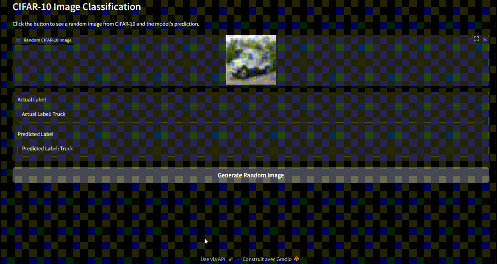

# CIFAR-10 Image Classifier

This project is a deep learning image classifier built with TensorFlow and Keras to classify images from the CIFAR-10 dataset. The model is implemented using a convolutional neural network (CNN) and can recognize 10 classes of objects, including airplanes, cars, birds, cats, and more.

## Demo


## Project Overview
The CIFAR-10 dataset consists of 60,000 32x32 color images in 10 classes, with 6,000 images per class. This model achieves around 77% accuracy on the test set.

## Model Architecture
The model is a Convolutional Neural Network (CNN) with the following layers:
- **Conv2D** layer with 32 filters and ReLU activation
- **MaxPooling2D** layer
- **Conv2D** layer with 64 filters and ReLU activation
- **MaxPooling2D** layer
- **Conv2D** layer with 128 filters and ReLU activation
- **MaxPooling2D** layer
- **Flatten** layer to transform the 2D matrix into a 1D vector
- **Dense** layer with 256 units and ReLU activation
- **Dense** output layer with 10 units and softmax activation

## Setup Instructions

1. **Clone the repository**:
   ```bash
   git clone https://github.com/yourusername/cifar10-image-classifier.git
   cd cifar10-image-classifier
   ```
   
2. **Install dependencies**:
   ```bash
   pip install -r requirements.txt
   ```

3. **Run the app**
    ```bash
    python test_ui.py
    ```

